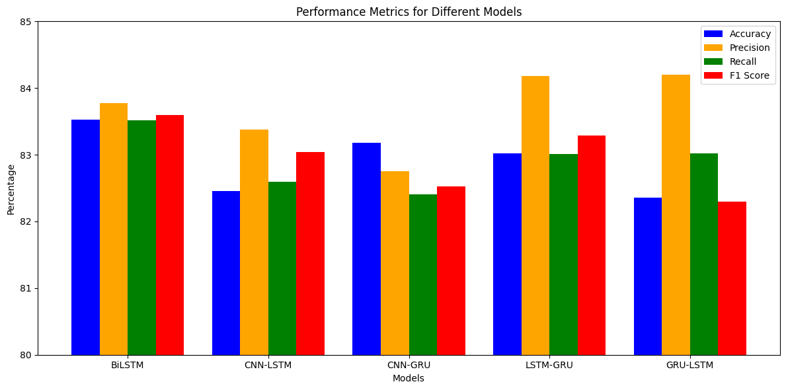

# BANGLA-HATESPEECH-DETECTION
We tried to implement a lightweight model with hybrid combination of different deep learning models. Hybrid models like LSTM-GRU combine the strengths of both architectures—LSTM's ability to capture long-term dependencies and GRU's efficiency in processing sequential data. This synergy improves performance on critical metrics like Precision and F1 Score, ensuring a better balance between detecting true positives and avoiding false positives. While accuracy may not significantly improve, the hybrid model's robustness in handling complex patterns makes it ideal for tasks requiring nuanced sequence understanding. Its adaptability to diverse data distributions justifies its superiority over single architecture models. 

## Model Comparison

### **CNN-LSTM**
- **Accuracy**: Moderate, slightly lower than GRU-LSTM and LSTM-GRU.
- **Precision**: Competitive but not the highest.
- **Recall**: Moderate.
- **F1 Score**: Balanced, but lower than LSTM-GRU.

### **CNN-GRU**
- **Accuracy**: Lowest among the four models.
- **Precision**: Below average.
- **Recall**: Weakest performance.
- **F1 Score**: The weakest, indicating overall underperformance compared to others.

### **LSTM-GRU**
- **Accuracy**: High, among the best after BiLSTM.
- **Precision**: The highest among the four, excelling in identifying relevant positives.
- **Recall**: Competitive but slightly lower than GRU-LSTM.
- **F1 Score**: High, indicating a good balance between precision and recall.

### **GRU-LSTM**
- **Accuracy**: Moderate.
- **Precision**: Strong, slightly below LSTM-GRU.
- **Recall**: Comparable to CNN-LSTM.
- **F1 Score**: Slightly lower than LSTM-GRU, suggesting a slight imbalance.

An analysis of our approached model is done here:

This work can be accessed here: [BANGLA-HATESPEECH-DETECTION](https://github.com/mahbuba26/BANGLA-HATESPEECH-DETECTION/blob/main/Our%20Final%20Work.ipynb)

